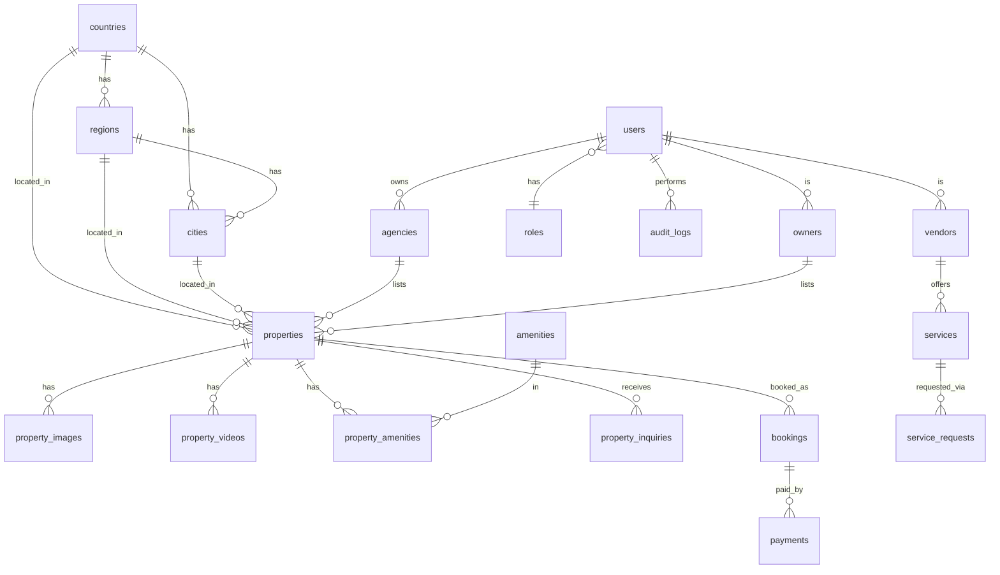

<title>Beta Facility — Platform Architecture</title>

# Beta Facility — Platform Architecture Blueprint

**An international property rental, management, listing, and services platform for Nigeria and Canada.**

This document is the blueprint for evolving the current Beta Facility website (Next.js on Render + Neon) into a multi-country marketplace, **without a from-scratch rewrite**. It covers the target website structure, database schema + ERD, folder structure, API design, role model, dashboard wireframes, and scalability / security / deployment recommendations, plus a phased implementation plan that keeps the live site working at every step.

---

## 1. Guiding principles

| Principle | How it's honoured |
|---|---|
| **One platform, many countries** | A single site; `country` is a first-class field, never hardcoded. Nigeria and Canada are rows in a `countries` table. |
| **Simple + scalable** | Normalised location tables, grouped listings (one card per building/type with a unit count), and DB indexes tuned for country/region/city filters. |
| **Cost-effective** | Render (app) + Neon (Postgres) + Cloudflare (CDN/WAF) + R2 (media) + Resend (email) — mostly free/low tiers that scale. |
| **Media out of the database** | Postgres stores only metadata + URLs; **all images/videos/docs live in Cloudflare R2**. |
| **Extend, don't rewrite** | Every phase ships on top of the working app; no big-bang cutover. |

---

## 2. Website structure

**Main navigation:** Home · Rentals · Property Management · Property Services · List Property · Agencies · About Us · Contact · Login

```
/                         Home (search hero, featured, stats, map preview)
/rentals                  Marketplace — grouped listings, filters, map
/rentals/[slug]           Property detail page (gallery, map, similar)
/property-management      Services + lead form (NG & CA audiences)
/property-services        Service marketplace (vendors)
/list-property            Submit a listing (owner/agency/developer/vendor) → admin approval
/agencies                 Agency directory + profiles
/about, /contact
/login                    Auth entry
/portal                   Role-aware dashboard (super-admin / staff / country-admin / agency / owner / vendor)
```

The country a visitor is browsing is held in the URL/query (`?country=NG`) and a cookie, so the same pages serve both markets.

---

## 3. Data model

### 3.1 Core tables

`users`, `roles`, `countries`, `regions`, `cities`, `properties`, `property_images`, `property_videos`, `amenities`, `property_amenities`, `rentals`, `agencies`, `owners`, `vendors`, `services`, `service_requests`, `property_inquiries`, `bookings`, `payments`, `audit_logs`.

### 3.2 Location structure (reusable, not hardcoded)

```
countries   id · name · countryCode(NG/CA) · currencyCode(NGN/CAD) · dialCode · active
regions     id · countryId · name · type("State"|"Province"|"Territory"|"FCT")
cities      id · countryId · regionId · name · latitude? · longitude?
```
Nigeria seeds 36 states + FCT; Canada seeds 10 provinces + 3 territories. Adding a country later = insert rows, no code change.

### 3.3 Properties (grouped listing = one row per building + rental category + bedroom type)

```
properties
  id · slug · title · description
  countryId · regionId · cityId · area · address · postalCode · latitude? · longitude?
  propertyType   (Studio|1–4+ Bedroom|Duplex|Detached|Semi-Detached|Townhouse|Condo|Apartment|Commercial|Land)
  rentalCategory (Short-let|Long-Term|Sale)
  bedroomType · bathrooms
  totalUnits · availableUnits          -- update the count, never duplicate cards
  price · pricePerWeek? · pricePerMonth? · rentPerYear? · currencyCode
  status         (Coming Soon|Available|Fully Occupied|Sold|Archived)
  furnished · petFriendly · parking     -- filter booleans
  listedByType   (BetaFacility|Agency|Owner|Vendor)
  listedById     -- FK to agency/owner/user
  featured · approved · active
  createdAt · updatedAt
```

Media is normalised so Postgres never holds binaries:

```
property_images   id · propertyId · url(R2) · category · sortOrder
                  category ∈ LivingRoom|Bedroom|ToiletBathroom|Kitchen|Building|FloorPlan|Other
property_videos   id · propertyId · url(R2) · title?
property_amenities  propertyId · amenityId          amenities  id · name · icon?
```

### 3.4 Actors & marketplace

```
agencies   id · userId · name · country · region · city · regNumber · cacNumber? · caBusinessNumber?
           logoUrl · phone · email · subscriptionPlan · verified
owners     id · userId · name · phone · email · country · region · city · verified
vendors    id · userId · companyName · country · region · city · coverageArea · rating · verified
services         id · vendorId · category · title · description · country · region · city · priceFrom?
service_requests id · serviceId? · category · name · email · phone · country · region · city · message · status
property_inquiries id · propertyId · name · email · phone · message · status
bookings   id · propertyId · guest… · dates · amount · currency · status   (existing short-let engine)
payments   id · reference · provider(Paystack) · amount · currency · status
audit_logs id · actorId · action · entity · entityId · meta · createdAt
```

### 3.5 Entity-relationship diagram



---

## 4. Roles & permissions (RBAC)

| Role | Scope | Can do |
|---|---|---|
| **Super Admin** | Global | Everything, all countries, settings, audit logs |
| **Beta Facility Staff** | Global (read) | View operations, generate reports (read-only) |
| **Country Admin** | One country | Approve/manage listings, agencies, vendors in their country only |
| **Agency** | Own agency | Manage own listings, view own leads |
| **Property Owner** | Own properties | Manage own listings, availability, view leads, request management |
| **Service Vendor** | Own services | Manage services, view/booking requests |

Enforced in **middleware** (route gating) *and* in every **server action / API route** (never trust the client). `Country Admin` permissions are scoped by `countryId`.

---

## 5. API / route architecture

Next.js App Router — **Server Components + Server Actions** for reads and admin mutations; **Route Handlers** for public POST endpoints and webhooks.

```
Server Components   list/detail pages (SSR, SEO, cached)
Server Actions      admin CRUD (create/update/archive property, approve, availability)
Route Handlers      /api/inquiries  /api/service-requests  /api/list-property
                    /api/bookings  /api/payments/*  /api/paystack/webhook
                    /api/upload (R2, admin)  /api/search (Meilisearch proxy, later)
```

Conventions: Zod validation on every input · rate-limit public POSTs · pagination via `?page`/`?cursor` · consistent JSON `{ data | error, issues }`.

---

## 6. Folder structure

```
src/
  app/
    (marketing)/            home, about, contact, property-management, property-services, agencies
    rentals/                page.tsx, [slug]/page.tsx
    list-property/          page.tsx
    portal/                 role-aware dashboard
      properties/ rentals/ agencies/ owners/ vendors/ services/
      users/ inquiries/ bookings/ locations/ settings/ report/
    api/                    inquiries, service-requests, list-property, upload, bookings, payments, search
  components/
    layout/ ui/ home/ property/ booking/ portal/ map/ forms/
  lib/                      db, auth, r2, listings, currency, search, analytics, rateLimit, validation
  data/                     countries, regions, cities, amenities, property-types
prisma/                     schema.prisma, migrations, seed.mjs
docs/                       ARCHITECTURE.md (this file)
```

---

## 7. Dashboard wireframes

**Admin (Super / Country) — `/portal`**
```
┌──────────────────────────────────────────────────────────┐
│ Beta Facility Admin        [Country ▼] [Search] [Profile] │
├───────────┬──────────────────────────────────────────────┤
│ Overview  │  users · properties · agencies · vendors      │  <- KPI tiles
│ Properties│  Filters: Country · Region · City · Type ·     │
│ Rentals   │           Listed By · Status · Availability    │
│ Agencies  │  ┌──────── properties table ───────────────┐  │
│ Owners    │  │ title · loc · type · units · status · ⚙ │  │
│ Vendors   │  └─────────────────────────────────────────┘  │
│ Services  │  [ + Add property ]   [ Export CSV ]          │
│ Users     │                                              │
│ Inquiries │                                              │
│ Bookings  │                                              │
│ Locations │                                              │
│ Settings  │                                              │
└───────────┴──────────────────────────────────────────────┘
```

**Agency dashboard** — My Listings · Add Listing · Leads · Subscription · Profile & verification
**Owner dashboard** — My Properties · Availability · Inquiries/Leads · Request Management
**Vendor dashboard** — My Services · Service Requests · Bookings · Coverage Area · Profile
**Staff (read-only)** — Overview + reports + CSV export, no edit controls

All dashboards share one shell; sections show/hide by role.

---

## 8. Frontend & UX

- **Grouped cards**: one card per building + rental category + bedroom type, with an **Available Units** count — never one card per unit.
- **Consistent card** for Beta Facility, Agency and Owner listings (no visual split): title · photo · country/region/city/area · property & rental type · units · price + **currency** · status chip (Coming Soon / Available / Fully Occupied) · amenities · Listed By · View Details.
- **Multi-currency**: format by `currencyCode` — `₦` (NGN) / `CA$` (CAD); a shared `formatMoney(amount, currency)` helper.
- **Property detail**: gallery, full location, price, beds/baths, units, amenities, description, source, enquire, **map**, similar properties.
- **Mobile-first**, Tailwind, accessible controls, visible focus states.

---

## 9. Map (Mapbox)

- `MapboxListingsMap` client component, dynamically imported (no SSR).
- Markers from `latitude`/`longitude`; **marker clustering** for dense areas; **city/region-centroid fallback** when a listing has no exact coordinates.
- Click marker → mini preview popup → **links to the property detail page**.
- Works for both Nigeria and Canada (bounds auto-fit to the filtered set).
- `NEXT_PUBLIC_MAPBOX_TOKEN` env; today's Leaflet/OSM map is the interim, swappable for Mapbox with no data-model change.

---

## 10. Search

- **Phase 1**: Postgres filters + indexes (country/region/city/type/category/price/status) with pagination.
- **Phase 2**: mirror properties into **Meilisearch** (or Typesense) for instant faceted search across country, region, city, area, price, currency, rental & property type, beds/baths, amenities, availability, listed-by. A thin `/api/search` proxy keeps the frontend unchanged.

---

## 11. File storage (Cloudflare R2)

- **No binaries in Postgres.** Images/videos/documents/floor-plans → R2; DB stores `url + category + sortOrder`.
- Admin upload → `/api/upload` (auth-guarded, image validation, size limit) → R2 → returns hosted URL.
- Served via R2 public domain behind Cloudflare CDN with long immutable cache. *(Already implemented in the current app.)*

---

## 12. Performance & scale (target: 100k+ properties, millions of photos)

Pagination/cursors · Cloudflare edge caching · `next/image` + lazy-loading · SSR for list/detail · Postgres indexes on `(countryId, regionId, cityId, rentalCategory, status, approved)` · media on R2/CDN · Meilisearch for search · connection pooling (Neon pooled URL). Read-heavy pages are cached; writes go through server actions.

---

## 13. Security

RBAC in middleware **and** server actions · secure auth (Auth.js, hashed passwords) · Zod input validation · image type/size validation on upload · admin approval before any public listing · **audit_logs** for admin actions · **rate limiting** on public POSTs · secrets only in env vars · country-scoped admin permissions · security headers + Cloudflare WAF/DDoS. *(Headers + WAF already in place.)*

---

## 14. Analytics & monitoring

- **PostHog + Google Analytics**: property views, country/region/city searches, listing clicks, lead & service requests, agency/owner/vendor signups.
- **Sentry**: errors, API failures, DB issues, auth issues, failed uploads/emails, map load errors.
- All added via env-gated client/server init so they're no-ops until keys are set.

---

## 15. Deployment

| Concern | Service |
|---|---|
| Source | **GitHub** (`eogbidi79/betafacility-next`) |
| Hosting | **Render** web service (`render.yaml` blueprint) |
| Database | **Neon** Postgres (pooled + direct URLs) |
| CDN + security | **Cloudflare** (proxy DNS → Render; WAF/DDoS/cache) |
| Media | **Cloudflare R2** (S3-compatible) |
| Email | **Resend** |
| Payments | **Paystack** (NG); add **Stripe** for CA later |
| Maps | **Mapbox** |
| Search | **Meilisearch** (managed or Render service) |

Migrations run on deploy (`prisma migrate deploy`); seed is idempotent.

---

## 16. Multi-currency (NGN / CAD)

Every price carries a `currencyCode`. `formatMoney(amount, "NGN"|"CAD")` renders `₦`/`CA$`. Payments route by currency (Paystack→NGN, Stripe→CAD). No FX conversion on-platform — prices are stored and shown in their listing currency.

---

## 17. Business model hooks (built into the schema)

Beta Facility rentals · property-management leads · **agency subscription plans** (`agencies.subscriptionPlan`) · **featured listings** (`properties.featured`) · service-marketplace commissions (via `bookings/payments`) · property advertising · diaspora management packages · Nigeria–Canada investment support. Each maps to existing fields, so monetisation is config, not rebuild.

---

## 18. Phased implementation roadmap

Each phase is shippable and keeps the live site working.

| Phase | Scope | Notes |
|---|---|---|
| **0 — Done** | Rentals grouped listings, admin CRUD, R2 uploads, map (Leaflet), security headers, heading = "Short-let & Long-Term Rentals" | Live |
| **1 — Location foundation** | `countries`/`regions`/`cities` tables + seed (NG 36+FCT, CA 10+3); add `countryId/regionId/cityId/currencyCode/propertyType/bathrooms/furnished/petFriendly/parking` to properties; **multi-currency** display | Enables Canada; no visual break |
| **2 — Marketplace depth** | Property **detail page**, richer property types, "Listed By" everywhere, similar properties, pagination | |
| **3 — Actors** | Agencies, Owners, Vendors + their dashboards; **List Property** flow with approval; Agencies directory | |
| **4 — Services marketplace** | `services`/`service_requests`, Property Services page, vendor profiles | |
| **5 — Property Management page** | Services content + lead form (NG & CA audiences) | |
| **6 — Search + Map upgrade** | Meilisearch faceted search; swap Leaflet → **Mapbox** with clustering | |
| **7 — Observability + monetisation** | PostHog/GA, Sentry, audit logs, rate limiting; subscription & featured-listing billing | |

**Recommended next step:** Phase 1 (location foundation + multi-currency) — it unlocks Canada and everything after it builds on the same location tables.
